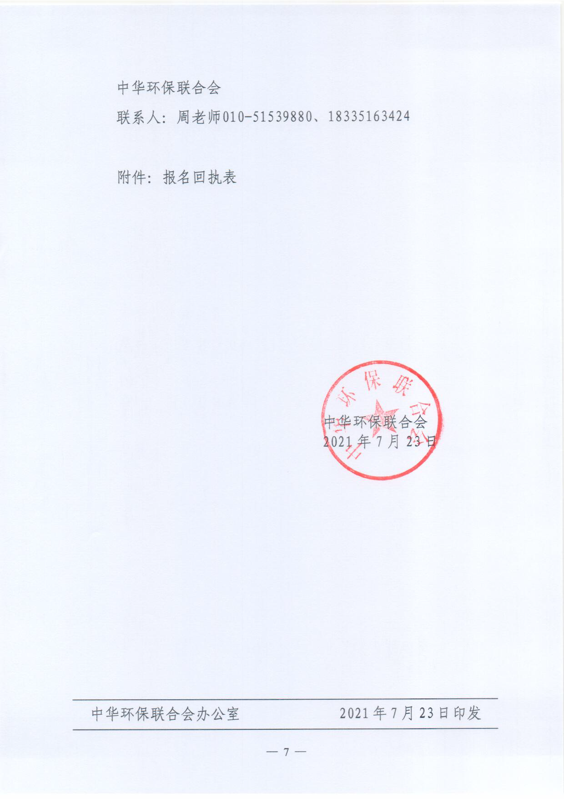

## 中华环保联合会关于举办“碳达峰碳中和”能力建设、企业与产品生命周期评价(LCA) 培训班的通知

Click the hyperlink to download thr <a href="https://ivl-china.github.io/ivl-china/documents/acef.pdf">PDF file</a>

You can also get a zip package by clicking <a href="https://ivl-china.github.io/ivl-china/documents/acef.zip">here</a> or <a href="https://pan.baidu.com/s/1Q0Y0lEqLUyv-W9CZ5fvHiQ">BaiduYunDisk</a> with password "ivlc" or <a href="https://ivl-china.github.io/ivl-china/documents/acef.zip">Tencent Weiyun</a>

